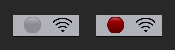

# BetterMicMute

A slightly different take on [MicMute](https://github.com/Hammerspoon/Spoons/tree/master/Spoons).

Microphone mute toggle and status indicator. Whenever an external process changes input settings, the spoon will override to the user's original intention.

## Setup

- Get familiar with [Hammerspoon](https://www.hammerspoon.org) first
- Get familiar with the BetterMicMute spoon ([relative link](Spoons/BetterMicMute.spoon/init.lua))
- See [init.lua](init.lua) for the simplest working configuration to get started

## Screenshots

Status indicator in action:

